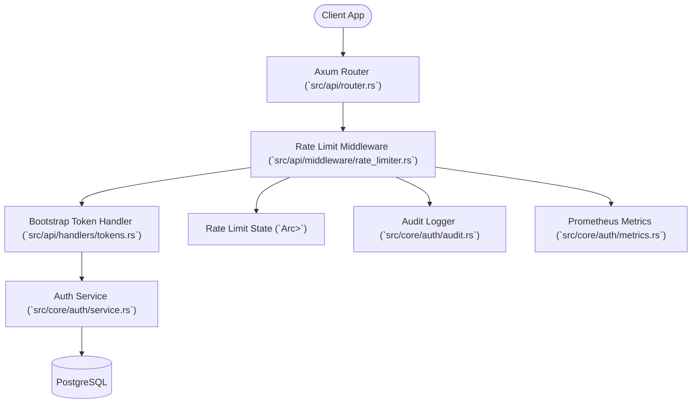

# Logical Components - Auth Enhancement (UOW-04 / US-021, US-022)

## Component Diagram (Logical)

## Component Descriptions

### 1. Rate Limit Middleware (`src/api/middleware/rate_limiter.rs`)
- **Responsibility**: Intercepts requests to the bootstrap token endpoint and enforces the rate limit.
- **Key Logic**:
  - Extracts source IP from request.
  - Checks `RLState` for current window count.
  - If limit exceeded:
    - Increments `utopia_rate_limited_requests_total` metric.
    - Emits structured audit log event.
    - Returns `AuthError::RateLimitExceeded` (mapped to HTTP 429).
  - If allowed:
    - Updates `RLState` count.
    - Forwards request to the handler.

### 2. Rate Limit State (`RLState`)
- **Responsibility**: Thread-safe in-memory storage for per-IP request counts.
- **Implementation**: `Arc<RwLock<HashMap<IpAddr, RateLimitState>>>`.
- **Lifecycle**: Initialized at app startup and passed via Axum `State`.

### 3. Background Evictor (Task)
- **Responsibility**: Prevents memory leaks by cleaning up stale IP entries.
- **Implementation**: A `tokio::spawn` loop that runs every 60 seconds.
- **Logic**: Iterates through `RLState` and removes entries where `now - window_start > 2 * window_size`.

### 4. Bootstrap Token Handler (`src/api/handlers/tokens.rs`)
- **Responsibility**: Handles the `POST /api/v1/bootstrap/tokens` request.
- **Integration**: Now protected by the `RLMiddleware`. It remains focused on token issuance logic.

### 5. Auth Service (`src/core/auth/service.rs`)
- **Responsibility**: Core business logic for token generation and validation.
- **Integration**: Unchanged by rate limiting, but its errors are now extended to include rate limit rejections.

## Integration Points

| From | To | Interaction | Purpose |
|------|----|-------------|---------|
| Middleware | RLState | Read/Write | Check and update IP request count |
| Middleware | AuditLog | Call | Log rate limit violation as security event |
| Middleware | Metrics | Call | Increment Prometheus counter |
| Middleware | Handler | Forward | Pass request to token issuance logic |
| Handler | AuthService | Call | Generate token |
| AuthService | DB | Query | Persist/Verify token |

## Resource Mapping

| Logical Component | Physical File |
|-------------------|--------------|
| Rate Limit Middleware | `src/api/middleware/rate_limiter.rs` |
| Rate Limit State | `src/api/middleware/rate_limiter.rs` (struct definition) |
| Background Evictor | `src/api/middleware/rate_limiter.rs` (spawned task) |
| Bootstrap Token Handler | `src/api/handlers/tokens.rs` |
| Auth Service | `src/core/auth/service.rs` |
| Audit Logger | `src/core/auth/audit.rs` |
| Metrics | `src/core/auth/metrics.rs` |
