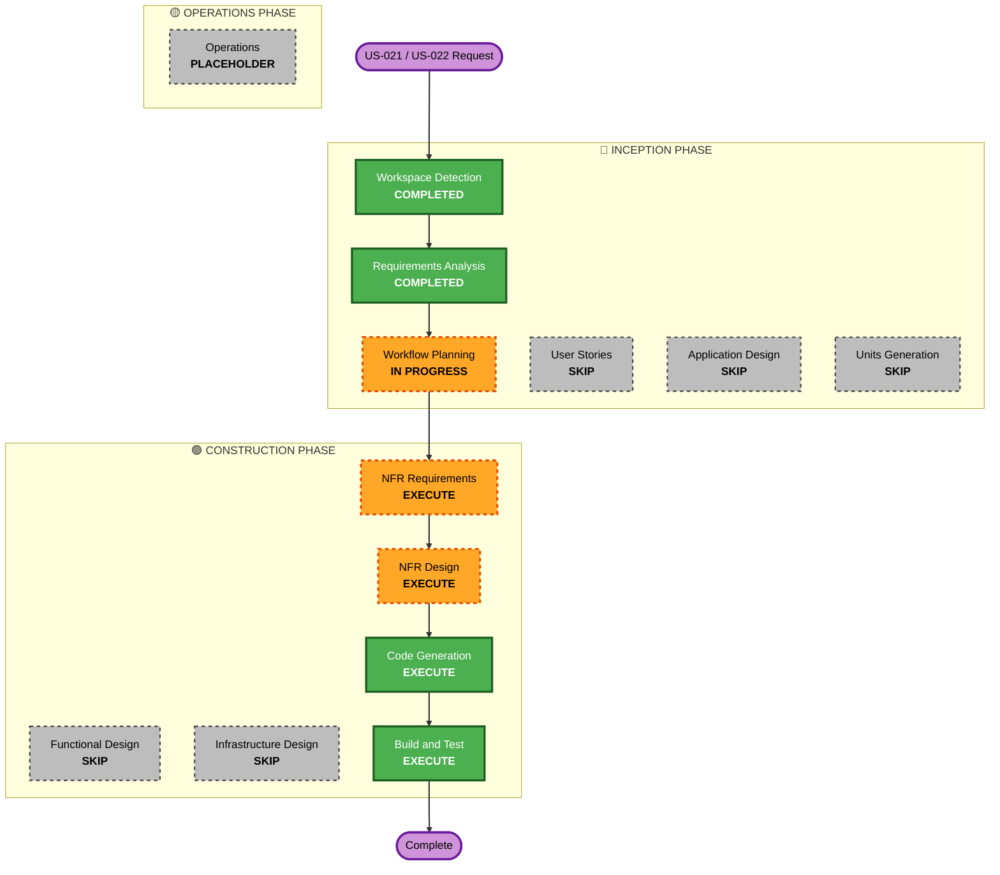

# Execution Plan — US-021 / US-022 Authentication Enhancement

## Detailed Analysis Summary

### Transformation Scope
- **Transformation Type**: Single component enhancement (existing auth module)
- **Primary Changes**: Rate limiting on bootstrap token endpoint, integration tests, documentation
- **Related Components**: `core/auth/`, `api/handlers/tokens.rs`, `api/router.rs`, `config.rs`

### Change Impact Assessment
- **User-facing changes**: No — internal security hardening
- **Structural changes**: No — within existing component boundaries
- **Data model changes**: No
- **API changes**: No — no new endpoints or changed contracts
- **NFR impact**: Yes — rate limiting introduced (SECURITY-11 compliance)

### Component Relationships
- **Primary Component**: `src/core/auth/` (service, middleware, validator)
- **API Layer**: `src/api/handlers/tokens.rs`, `src/api/router.rs`
- **Configuration**: `src/config.rs` (rate limit settings)
- **Tests**: `tests/core/auth_validator_test.rs`, `tests/core/token_lifecycle_test.rs`, new integration tests

### Risk Assessment
- **Risk Level**: Low
- **Rollback Complexity**: Easy (isolated changes)
- **Testing Complexity**: Moderate (integration tests for auth flows)

## Workflow Visualization

## Phases to Execute

### 🔵 INCEPTION PHASE
- [x] Workspace Detection (COMPLETED)
- [x] Requirements Analysis (COMPLETED)
- [x] Execution Plan (IN PROGRESS)
- [ ] Application Design — **SKIP**
  - **Rationale**: Changes are within existing component boundaries; no new components needed
- [ ] Units Generation — **SKIP**
  - **Rationale**: Single unit of work; no complex decomposition needed

### 🟢 CONSTRUCTION PHASE
- [ ] Functional Design — **SKIP**
  - **Rationale**: No new business logic; auth flow already fully defined and implemented
- [ ] NFR Requirements — **EXECUTE**
  - **Rationale**: Rate limiting is a new NFR (SECURITY-11 compliance); need to assess requirements
- [ ] NFR Design — **EXECUTE**
  - **Rationale**: Need to design rate limiting strategy for bootstrap endpoint
- [ ] Infrastructure Design — **SKIP**
  - **Rationale**: No infrastructure changes; rate limiting is application-level middleware
- [ ] Code Generation — **EXECUTE** (ALWAYS)
  - **Rationale**: Implementation of rate limiting and integration tests
- [ ] Build and Test — **EXECUTE** (ALWAYS)
  - **Rationale**: Build, test, and verification needed

### 🟡 OPERATIONS PHASE
- [ ] Operations — PLACEHOLDER
  - **Rationale**: Future deployment and monitoring workflows

## Estimated Timeline
- **Total Phases**: 4 (NFR Requirements, NFR Design, Code Generation, Build & Test)
- **Estimated Duration**: Short iteration (auth enhancement scope)

## Success Criteria
- **Primary Goal**: US-021 and US-022 acceptance criteria satisfied
- **Key Deliverables**:
  - Rate limiting on bootstrap token endpoint
  - Integration tests covering token issuance, revocation, and 401 rejection
  - PBT for serialization round-trips
  - Updated OpenAPI documentation
- **Quality Gates**:
  - `cargo check` passes
  - All tests pass
  - Security Baseline rules compliant
