# Execution Plan

## Detailed Analysis Summary

### Change Impact Assessment
- **User-facing changes**: Yes — New API endpoints and response contracts consumed by household finance client apps.
- **Structural changes**: Yes — Greenfield; all architecture and service layers are new.
- **Data model changes**: Yes — New data models for accounts, transactions, budgets, currencies, and users.
- **API changes**: Yes — Firefly-III compatible REST API surface (partial compatibility matrix).
- **NFR impact**: Yes — Security extension (blocking) and property-based testing (partial) are both active. Financial correctness demands precise monetary arithmetic and round-trip serialization guarantees.

### Risk Assessment
- **Risk Level**: Medium
- **Rollback Complexity**: Easy (greenfield; no existing data to migrate)
- **Testing Complexity**: Moderate (financial arithmetic precision, API contract compatibility, PBT on serialization round-trips)

---

## Workflow Visualization

```mermaid
flowchart TD
    Start(["User Request"])

    subgraph INCEPTION["🔵 INCEPTION PHASE"]
        WD["Workspace Detection\n**COMPLETED**"]
        RA["Requirements Analysis\n**COMPLETED**"]
        US["User Stories\n**COMPLETED**"]
        WP["Workflow Planning\n**IN PROGRESS**"]
        AD["Application Design\n**EXECUTE**"]
        UG["Units Generation\n**EXECUTE**"]
    end

    subgraph CONSTRUCTION["🟢 CONSTRUCTION PHASE"]
        FD["Functional Design\n**EXECUTE**"]
        NFRA["NFR Requirements\n**EXECUTE**"]
        NFRD["NFR Design\n**EXECUTE**"]
        ID["Infrastructure Design\n**EXECUTE**"]
        CG["Code Generation\n**EXECUTE**"]
        BT["Build and Test\n**EXECUTE**"]
    end

    subgraph OPERATIONS["🟡 OPERATIONS PHASE"]
        OPS["Operations\n**PLACEHOLDER**"]
    end

    Start --> WD
    WD --> RA
    RA --> US
    US --> WP
    WP --> AD
    AD --> UG
    UG --> FD
    FD --> NFRA
    NFRA --> NFRD
    NFRD --> ID
    ID --> CG
    CG --> BT
    BT --> OPS
    OPS --> End(["Complete"])

    style WD fill:#4CAF50,stroke:#1B5E20,stroke-width:3px,color:#fff
    style RA fill:#4CAF50,stroke:#1B5E20,stroke-width:3px,color:#fff
    style US fill:#4CAF50,stroke:#1B5E20,stroke-width:3px,color:#fff
    style WP fill:#FFA726,stroke:#E65100,stroke-width:3px,stroke-dasharray: 5 5,color:#000
    style AD fill:#FFA726,stroke:#E65100,stroke-width:3px,stroke-dasharray: 5 5,color:#000
    style UG fill:#FFA726,stroke:#E65100,stroke-width:3px,stroke-dasharray: 5 5,color:#000
    style FD fill:#FFA726,stroke:#E65100,stroke-width:3px,stroke-dasharray: 5 5,color:#000
    style NFRA fill:#FFA726,stroke:#E65100,stroke-width:3px,stroke-dasharray: 5 5,color:#000
    style NFRD fill:#FFA726,stroke:#E65100,stroke-width:3px,stroke-dasharray: 5 5,color:#000
    style ID fill:#FFA726,stroke:#E65100,stroke-width:3px,stroke-dasharray: 5 5,color:#000
    style CG fill:#4CAF50,stroke:#1B5E20,stroke-width:3px,color:#fff
    style BT fill:#4CAF50,stroke:#1B5E20,stroke-width:3px,color:#fff
    style OPS fill:#BDBDBD,stroke:#424242,stroke-width:2px,stroke-dasharray: 5 5,color:#000
    style Start fill:#CE93D8,stroke:#6A1B9A,stroke-width:3px,color:#000
    style End fill:#CE93D8,stroke:#6A1B9A,stroke-width:3px,color:#000

    linkStyle default stroke:#333,stroke-width:2px
```

---

## Phases to Execute

### 🔵 INCEPTION PHASE

- [x] Workspace Detection — COMPLETED
- [x] Reverse Engineering — SKIPPED (Greenfield project)
- [x] Requirements Analysis — COMPLETED
- [x] User Stories — COMPLETED
- [ ] Workflow Planning — IN PROGRESS (this document)
- [ ] Application Design — **EXECUTE**
  - **Rationale**: New Rust API service with multiple domain layers (accounts, transactions, budgets). Component boundaries, service trait definitions, and repository patterns need to be established before implementation.
- [ ] Units Generation — **EXECUTE**
  - **Rationale**: System has multiple domains with distinct data models and endpoint groups. Decomposing into implementation units (e.g., auth, accounts, transactions, budgets, metadata) will enable sequential, focused code generation with clear scope per unit.

### 🟢 CONSTRUCTION PHASE (per-unit loop)

- [ ] Functional Design — **EXECUTE**
  - **Rationale**: New financial data models (monetary amounts, transaction types, account types) and domain business rules require precise schema and logic definition before code generation.
- [ ] NFR Requirements — **EXECUTE**
  - **Rationale**: Security extension (blocking) is active. PBT extension (partial) is active. NFR requirements must be explicitly assessed per unit to enforce security-by-default and PBT coverage on monetary calculations.
- [ ] NFR Design — **EXECUTE**
  - **Rationale**: Follows from NFR Requirements execution. Security patterns (token validation, authorization scoping), monetary arithmetic design, and PBT target selection must be designed before code generation.
- [ ] Infrastructure Design — **EXECUTE**
  - **Rationale**: Rust binary deployment for self-hosted scenario requires container/service configuration. Database engine selection, migration strategy, and deployment topology should be specified before generating infrastructure-dependent code.
- [ ] Code Generation — **EXECUTE** (ALWAYS)
  - **Rationale**: Implementation planning and code generation for all units.
- [ ] Build and Test — **EXECUTE** (ALWAYS)
  - **Rationale**: Build, test execution, and verification instructions for all units.

### 🟡 OPERATIONS PHASE

- [ ] Operations — **PLACEHOLDER**
  - **Rationale**: Future deployment and monitoring workflows; not in current scope.

---

## Success Criteria

- **Primary Goal**: A Rust API service that passes compatibility checks for supported Firefly-III endpoints and satisfies security and PBT extension constraints.
- **Key Deliverables**:
  - Domain data models for accounts, transactions, budgets, currencies
  - REST API handlers with Firefly-III compatible request/response schemas
  - Bearer token authentication and per-user authorization
  - Property-based tests for monetary calculations and payload serialization
  - Self-hosted deployment configuration (container or binary packaging)
- **Quality Gates**:
  - All Must-priority stories have passing acceptance criteria tests
  - Security extension constraints satisfied (auth, input validation, OWASP Top 10)
  - PBT enforced on monetary arithmetic and serialization round-trips
  - API contract validated against Firefly-III schema for targeted endpoints
