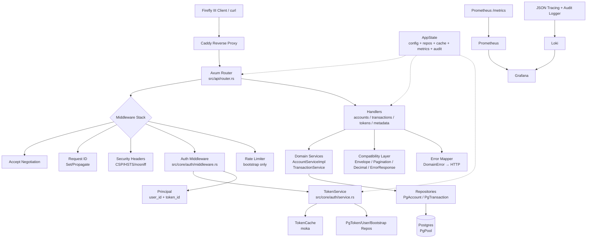
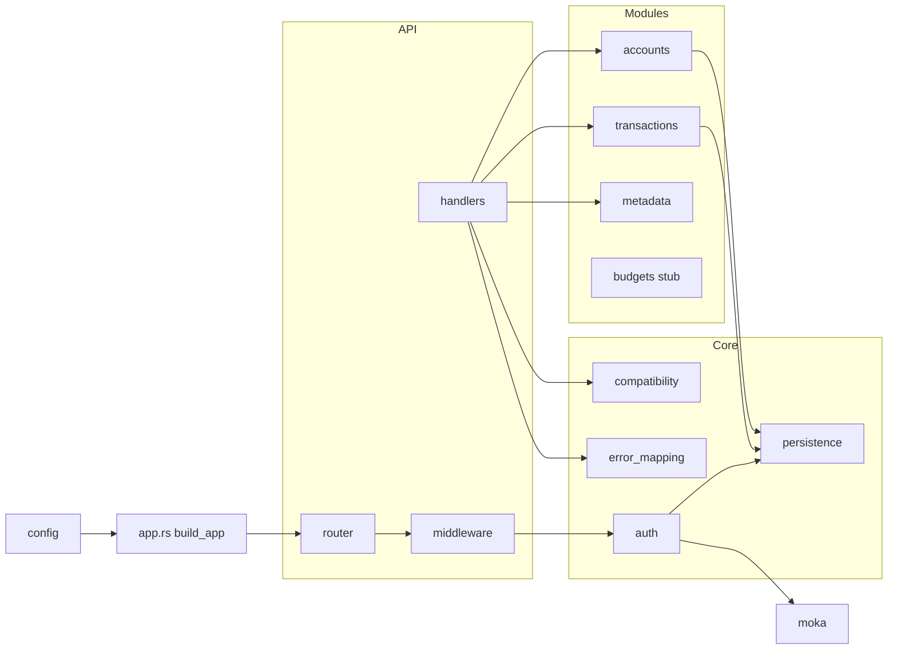
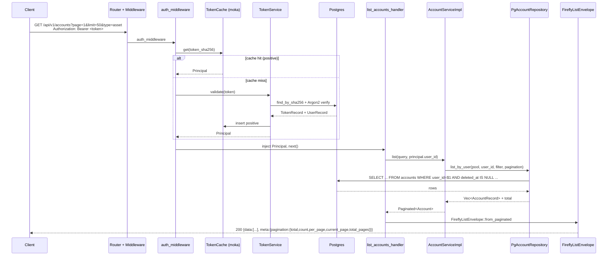
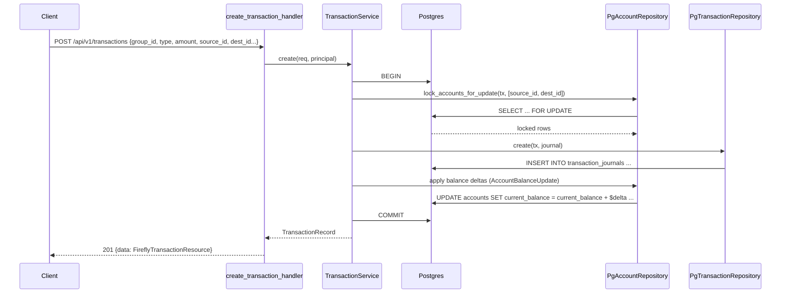
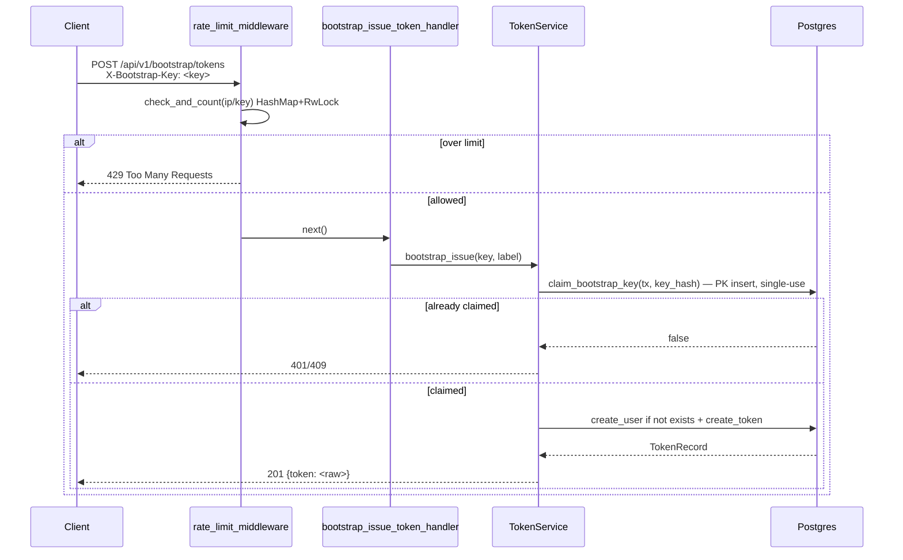
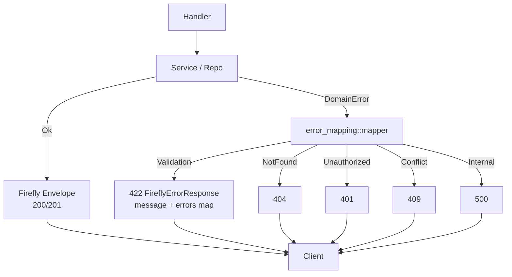

# Architecture — Utopia

## System Overview
Utopia is a **monolithic Rust API server** (Axum + Tokio + SQLx + Postgres) that exposes a Firefly III-compatible JSON API. All business logic lives in a single binary (`src/main.rs` → `src/app.rs` → `src/api/router.rs`). Persistence is Postgres via `sqlx` with compile-time checked queries and `sqlx::migrate!` migrations. There is no separate frontend, worker, or microservice — deployment is a single container behind Caddy (reverse proxy) with Prometheus/Loki/Grafana for observability.

The architecture is **layered + modular monolith**:
- **API layer** (Axum handlers + router) — HTTP boundary, request parsing, Firefly envelope shaping.
- **Core layer** (`src/core/*`) — cross-cutting concerns: auth, compatibility (envelope/pagination/decimal/error), persistence (repositories), error mapping.
- **Modules layer** (`src/modules/*`) — domain modules (accounts, transactions, metadata, budgets stub) owning business rules and service traits.
- **Infra layer** — config, DB pool, cache, metrics, audit logger, rate limiter.

## Architectural Style
- **Style:** Modular monolith, layered (API → Core/Modules → Persistence). Evidence: single `utopia` binary crate, single `build_router` in `src/api/router.rs`, shared `AppState` injected via `Arc`, no inter-service RPC.
- **Communication:** In-process function calls + async traits (`async-trait`); HTTP is the only external boundary. No message queue, no event bus.
- **Data access:** Repository pattern with async traits (`TokenReadRepository`, `AccountReadRepository`, etc.) backed by `PgPool`/`Transaction<Postgres>`. `Repositories` struct aggregates all `Pg*Repository` impls.
- **Auth:** Bearer token (SHA256 lookup + Argon2 verify) with `moka` cache (positive + negative) and `Principal` extension injection via `auth_middleware`.
- **Compatibility:** Explicit Firefly III contract layer (`src/core/compatibility/*`) — envelope, pagination, decimal string, error response — kept separate from domain types so Firefly parity can be reasoned about in one place.

## Component Relationships

## Data Flow

### Request lifecycle (authenticated route)
1. Caddy terminates TLS, forwards to Axum.
2. Global layers: `accept_header_middleware` (content negotiation), `SetRequestId`/`PropagateRequestId`, security headers.
3. `auth_middleware` extracts `Authorization: Bearer <token>`, SHA256-hashes, checks `TokenCache` (positive/negative), falls back to `TokenService::validate` (DB lookup + Argon2 verify), injects `Principal` into request extensions, spawns fire-and-forget `update_last_used_at`.
4. Handler parses query/body, delegates to domain service (`AccountServiceImpl`, `TransactionService`), which uses repository traits against `PgPool`/`Transaction`.
5. Service returns domain result or `DomainError`; handler maps via `error_mapping::mapper` to `FireflyErrorResponse` with appropriate HTTP status.
6. Response is wrapped in `FireflyListEnvelope` or `FireflySingleEnvelope` with `meta.pagination` where applicable; `DecimalAmount` serializes amounts as strings.

### Transaction balance flow
`create/update/delete` transaction → `TransactionService` opens DB transaction → `lock_accounts_for_update` (`SELECT ... FOR UPDATE` on `accounts`) → insert/update/delete `transaction_journals` → apply `AccountBalanceUpdate` deltas → commit. Atomicity is DB-transaction scoped.

### Bootstrap flow
`POST /api/v1/bootstrap/tokens` with `X-Bootstrap-Key` → `rate_limit_middleware` (in-memory `HashMap` + `RwLock`, fail-open) → `TokenService::bootstrap_issue` → constant-time compare of key hash → `claim_bootstrap_key` (atomic single-use via `bootstrap_key_usage` PK) → create user if needed → issue token.

## Key Design Decisions

| Decision | Rationale | Consequence / Trade-off |
|---|---|---|
| Single binary monolith (Axum) | Minimal ops, Firefly compat surface is small, team size favors monolith | Easy to reason about; no distributed transactions; scaling is vertical + replica behind Caddy |
| Repository traits with `async-trait` + `Executor` generic | Testability (mock repos), compile-time SQL via `sqlx`, transaction vs pool flexibility | Verbose trait surface (15+ methods), `create` with 15+ positional args — builder would be safer |
| `moka` cache for tokens (positive + negative) | Avoid Argon2 on every request (expensive) | Cache invalidation on revoke is TTL-based; negative cache prevents DB hammer on invalid tokens |
| Firefly envelope/pagination/decimal as separate `core/compatibility` | Isolate Firefly contract so drift is visible and testable | Duplication of pagination parsing (3 copies) — should be unified |
| Soft-delete for accounts (`deleted_at` + partial unique index) | Firefly expects soft-delete; preserves name uniqueness for active only | Queries must always filter `deleted_at IS NULL`; hard delete would break Firefly clients |
| `SELECT FOR UPDATE` for balance updates | Correctness under concurrent transaction writes | Holds row locks for duration of DB transaction — contention under high write concurrency |
| In-memory rate limiter for bootstrap | Simplicity, no Redis dependency | Not distributed; fail-open on errors may hide bugs; resets on restart |
| Static currency table (20 entries) | Fast, no migration needed for MVP | No CRUD, no per-currency decimal_places enforcement (JPY 0 vs USD 2 mismatch) |
| `openapi.yaml` as contract source of truth | Single place for Firefly compat surface, ~1500 lines | Duplicate `UpdateAccountRequest` schema block — needs fix; budgets etc. absent |

## Interaction Diagrams

### Sequence: List Accounts (authenticated)

### Sequence: Create Transaction (with balance locking)

### Sequence: Bootstrap Token Issuance (rate-limited, single-use)

### Flow: Error Mapping

## Improvement Opportunities
- **Unify pagination parsing** — three copies (`metadata.rs`, `accounts/types.rs`, `transactions.rs`) → single `core/compatibility::pagination::parse` helper.
- **Builder for `AccountWriteRepository::create`** — 15+ positional args is error-prone; introduce `CreateAccountParams` struct.
- **Distributed rate limiting** — replace in-memory `HashMap` with Redis or Postgres-backed limiter if multi-replica deploys are planned; fix fail-open to fail-closed for non-rate-limit errors.
- **Currency model** — move `CURRENCY_TABLE` to DB table with CRUD and enforce `decimal_places` per currency in `DecimalAmount::format_amount`.
- **Transaction resource enrichment** — resolve `user` (principal email) and `source_name`/`destination_name` via join or `find_by_ids` instead of empty/None.
- **OpenAPI fix** — deduplicate `UpdateAccountRequest` schema (second `type: object` block overwrites first).
- **Budgets module** — implement or explicitly mark as out-of-scope in `openapi.yaml` with 501.
- **Cache invalidation** — on `revoke_token`, evict positive cache entry immediately instead of waiting for TTL.
